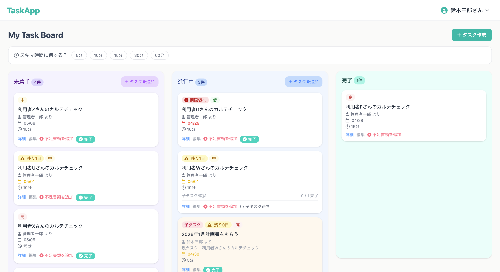
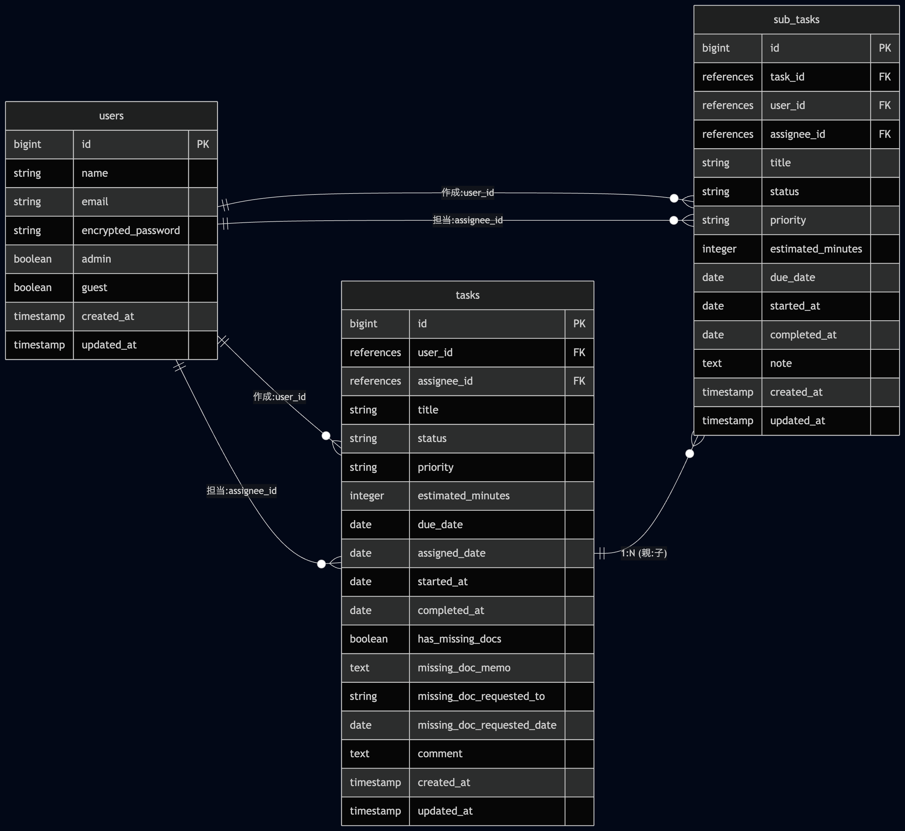

# カルテチェック管理アプリ（TaskApp）

## アプリの概要
紙ベースで管理されていた訪問看護のカルテチェック業務を効率化するために開発したタスク管理アプリです。
ドラッグ＆ドロップで簡単に進捗を変更できます。

## アプリ画面

## アプリの使い方
①ログイン
トップページからゲストログインが可能です。
※ゲストユーザーはアカウント情報の編集はできません。

②タスクを確認
カンバンボード形式で担当になっているタスクが表示されます。

③タスクを進める
タスクはドラッグ&ドロップで移動でき、進捗を更新できます。

④スキマ時間でタスクを消化
所要時間を参考に、スキマ時間にできるタスクを進めることができます。

⑤タスクの作成・編集
新規タスクの作成や編集が可能です。
不足書類がある場合は、子タスクとして新たにタスクを作成することができます。

⑥タスク管理
自分が作成したタスク一覧ページから、タスクの確認や編集・削除が可能です。

## 工夫したところ
### ＊カンバンボードによる進捗の可視化  
カンバン形式にし、タスクの状態を一目で把握できるようにしました。  
StimulusとSortableJSを用いてドラッグ＆ドロップ操作を実装し、Request.jsにより画面遷移なしでデータベースへの保存できるようにしました。

### ＊スキマ時間を活用できる設計
訪問看護では訪問業務が中心であり、事務所での作業時間は限られています。  
そのため、タスクに所要時間を設定することで、5〜10分のスキマ時間でも対応可能なタスクを選びやすくしました。  
これにより、業務の効率化を図り、タスクの蓄積を防ぐことを意識しました。

## 使用技術
フロントエンド
・HTML / CSS ( Tailwind CSS 4.4 )
・JavaScript：Hotwire ( Turbo / Stimulus )

バックエンド
・Ruby 3.3.3
・Ruby on Rails 7.2.3
・Devise（ログイン機能）
・Rails-i18n（日本語化対応）

インフラ・開発環境
・データベース：PostgreSQL（本番環境） 
・デプロイ：Heroku
・バージョン管理：Git / GitHub
・開発環境：macOS ( MacBook Air )

## ER図

## 制作背景
訪問看護師として勤務する中で、カルテチェック業務の管理係を担当していました。
当時はすべてアナログな紙の管理表で、以下の項目を管理していました。

・タスク名（例：「利用者Aさんのカルテチェック」）
・担当スタッフ名・依頼日
・期限日
・不足書類の有無（例：計画書の利用者サインもれ等）
・完了チェック欄

##紙管理による課題
管理係の負担：膨大なリストからの探索
タスクは紙に作成順で書かれているため、特定のスタッフの進捗を確認するには、リストを上から下まで一行ずつ読み飛ばさずに探す必要がありました。期限切れも目立たず、見逃しがないか注意しなければならない状況が、大きな業務負担となっていました。

スタッフの状況：視界に入らないことによるタスクの後回し
管理表は壁に貼られたままで、普段の動線からは外れていました。そのため、意識的に見に行かない限りタスクが視界に入らず、ついつい後回しにして放置することが常態化していました。

チームの不和：時間の有効活用と不公平感
隙間時間をうまく使ってスムーズにチェックをこなすスタッフがいる一方で、放置し続けるスタッフもおり、「時間を有効活用できていない」という不満や不公平感が生まれていました。

リスク：監査による減算
チェックが滞ることで、書類の不備が発見されないまま放置されます。万が一、この状態で監査が入れば、書類不備による減算リスクがありました。

## 解決策
直感的な進捗把握：カンバンボードにより、誰が・どのタスクを・どの段階まで進めているかが一目で分かります。

期限の可視化：期限が迫っているタスクが強調されることで、管理者の「探し出す」手間を省きます。

「スキマ時間」の有効活用：5分・10分といった短時間で終わるタスクを抽出。忙しい訪問の合間でも、スタッフが自発的にタスクを消化できる仕組みを作りました。
